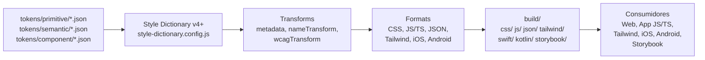

# FASE 2 — STYLE DICTIONARY v4+ INTEGRATION
> Multi-Platform Token Build System  
> Configuración + Transforms + Formats Custom

---

## 📦 Estructura de Tokens Reorganizada

```
07-token-platform/
├── FASE-0-AUDIT.md
├── FASE-1-SCHEMA.md
├── FASE-2-STYLE-DICTIONARY.md           ← TÚ ERES AQUÍ
├── FASE-3-AGENTS.md
├── FASE-4-GOVERNANCE.md
├── token-metadata.schema.json            (FASE 1)
├── style-dictionary.config.js            ← NUEVO (build config)
├── tokens/
│   ├── primitive/
│   │   ├── colors.json                   (paletas base: promptea, nova, ocean)
│   │   ├── typography.json               (familias, weights, sizes)
│   │   ├── spacing.json                  (escala 4px)
│   │   ├── borders.json                  (radius, width)
│   │   ├── shadows.json                  (5 niveles)
│   │   ├── motion.json                   (duraciones, easing)
│   │   └── media.json                    (aspect ratios, etc.)
│   ├── semantic/
│   │   ├── colors.json                   (semánticos: color-action, color-danger, etc.)
│   │   ├── typography.json               (font-family-base, font-weight-bold, etc.)
│   │   ├── spacing.json                  (space-*, padding-*, margin-*)
│   │   ├── borders.json                  (radius-*, border-width-*)
│   │   ├── shadows.json                  (shadow-*, elevation-*)
│   │   ├── motion.json                   (motion-*, transition-*)
│   │   └── layout.json                   (breakpoints, touch targets)
│   └── component/
│       ├── action.json                   (Button, Link, Icon)
│       ├── content.json                  (Card, Cell, Accordion)
│       ├── control.json                  (Checkbox, Radio, Switch)
│       ├── input.json                    (Input field, Dropdown, Slider)
│       ├── feedback.json                 (Alert, Toast, Tooltip, Progress)
│       ├── navigation.json               (Navbar, Tabs, Breadcrumb)
│       ├── overlay.json                  (Modal, Sheet)
│       └── data-display.json             (Charts)
├── transforms/
│   ├── metadata.transform.js             (preserva $extensions en salida)
│   ├── nameTransform.js                  (aplica schema de nombres)
│   └── wcagTransform.js                  (inyecta metadata WCAG)
├── formats/
│   ├── cssWithMetadata.format.js         (CSS + comentarios de metadata)
│   ├── jsTyped.format.js                 (JS/TS con TypeScript types)
│   ├── jsonStructured.format.js          (JSON jerárquico con metadata)
│   ├── tailwindPreset.format.js          (Tailwind config preset)
│   ├── swiftTokens.format.js             (iOS)
│   ├── kotlinTokens.format.js            (Android)
│   └── storybook.format.js               (Para Storybook addon)
└── build/
    ├── (generado por Style Dictionary)
    ├── css/
    │   ├── tokens.css                    (salida: CSS custom properties)
    │   ├── tokens-with-metadata.css      (salida: CSS + comentarios)
    │   └── tokens-branded.css            (salida: per-brand overrides)
    ├── scss/
    │   └── tokens.scss
    ├── js/
    │   ├── tokens.js                     (ESM)
    │   ├── tokens.d.ts                   (TypeScript definitions)
    │   └── tokens-with-metadata.js       (incluye $extensions)
    ├── json/
    │   ├── tokens.json                   (flat structure)
    │   └── tokens-structured.json        (jerarquía completa + metadata)
    ├── tailwind/
    │   └── preset.js                     (para Tailwind.config.js)
    ├── swift/
    │   └── Tokens.swift
    ├── kotlin/
    │   └── Tokens.kt
    └── storybook/
        └── tokens.json
```

---

## ⚙️ style-dictionary.config.js (Configuración Multi-Plataforma)

```javascript
// 07-token-platform/style-dictionary.config.js
// Style Dictionary v4+ configuration
// Genera CSS, SCSS, JS/TS, JSON, Tailwind, iOS, Android para cada brand × theme

const fs = require('fs');
const path = require('path');

// Importar transforms y formats custom
const metadataTransform = require('./transforms/metadata.transform');
const nameTransformFn = require('./transforms/nameTransform');
const wcagTransform = require('./transforms/wcagTransform');
const cssWithMetadataFormat = require('./formats/cssWithMetadata.format');
const jsTypedFormat = require('./formats/jsTyped.format');
const tailwindPresetFormat = require('./formats/tailwindPreset.format');
const swiftTokensFormat = require('./formats/swiftTokens.format');
const kotlinTokensFormat = require('./formats/kotlinTokens.format');

module.exports = {
  // Metadatos globales
  $schema: "https://tokens.studio/schema/draft.json",
  version: "2.2.1",
  name: "Design.MD White Label",
  
  // Entradas: estructura de tokens (DTCG compatible)
  source: [
    'tokens/primitive/**/*.json',
    'tokens/semantic/**/*.json',
    'tokens/component/**/*.json'
  ],

  // Platforms: definir múltiples salidas (brand × theme)
  platforms: {
    // ============================================================
    // WEB (CSS + JS + JSON, múltiples brands/themes)
    // ============================================================
    'web-css-promptea-light': {
      transformGroup: 'web',
      buildPath: 'build/css/promptea-light/',
      files: [
        {
          destination: 'tokens.css',
          format: 'css/variables',
          options: { outputReferences: true }
        },
        {
          destination: 'tokens-with-metadata.css',
          format: 'css/custom-metadata',
          options: { outputReferences: true }
        }
      ],
      transforms: ['attribute/cti', 'name/cti/kebab', metadataTransform],
      filters: [
        { attributes: { brand: 'promptea', theme: 'light' } }
      ]
    },
    'web-css-nova-light': {
      transformGroup: 'web',
      buildPath: 'build/css/nova-light/',
      files: [
        {
          destination: 'tokens.css',
          format: 'css/variables',
          options: { outputReferences: true }
        },
        {
          destination: 'tokens-with-metadata.css',
          format: 'css/custom-metadata',
          options: { outputReferences: true }
        }
      ],
      transforms: ['attribute/cti', 'name/cti/kebab', metadataTransform],
      filters: [
        { attributes: { brand: 'nova', theme: 'light' } }
      ]
    },
    'web-css-ocean-light': {
      transformGroup: 'web',
      buildPath: 'build/css/ocean-light/',
      files: [
        {
          destination: 'tokens.css',
          format: 'css/variables',
          options: { outputReferences: true }
        },
        {
          destination: 'tokens-with-metadata.css',
          format: 'css/custom-metadata',
          options: { outputReferences: true }
        }
      ],
      transforms: ['attribute/cti', 'name/cti/kebab', metadataTransform],
      filters: [
        { attributes: { brand: 'ocean', theme: 'light' } }
      ]
    },
    'web-css-promptea-dark': {
      transformGroup: 'web',
      buildPath: 'build/css/promptea-dark/',
      files: [
        {
          destination: 'tokens.css',
          format: 'css/variables',
          options: { outputReferences: true }
        },
        {
          destination: 'tokens-with-metadata.css',
          format: 'css/custom-metadata',
          options: { outputReferences: true }
        }
      ],
      transforms: ['attribute/cti', 'name/cti/kebab', metadataTransform],
      filters: [
        { attributes: { brand: 'promptea', theme: 'dark' } }
      ]
    },
    // ... (nova-dark, ocean-dark similar)

    // ============================================================
    // JS/TS (ESM + TypeScript definitions)
    // ============================================================
    'web-js-typed': {
      transformGroup: 'web',
      buildPath: 'build/js/',
      files: [
        {
          destination: 'tokens.js',
          format: 'javascript/es6',
          options: { outputReferences: true }
        },
        {
          destination: 'tokens.d.ts',
          format: 'typescript/es6-declarations',
          options: { outputReferences: true }
        },
        {
          destination: 'tokens-with-metadata.js',
          format: 'javascript/es6-with-metadata',
          options: { outputReferences: true, includeExtensions: true }
        }
      ],
      transforms: ['attribute/cti', 'name/cti/camel', metadataTransform],
      filters: [
        { attributes: { category: ['primitive', 'semantic'] } }
      ]
    },

    // ============================================================
    // JSON (para agentes IA, estructura jerárquica)
    // ============================================================
    'json-structured': {
      transformGroup: 'web',
      buildPath: 'build/json/',
      files: [
        {
          destination: 'tokens-structured.json',
          format: 'json/structured-with-metadata',
          options: {
            outputReferences: true,
            includeExtensions: true
          }
        }
      ],
      transforms: ['attribute/cti', metadataTransform]
    },

    // ============================================================
    // TAILWIND (preset para Tailwind CSS)
    // ============================================================
    'tailwind-preset': {
      transformGroup: 'web',
      buildPath: 'build/tailwind/',
      files: [
        {
          destination: 'preset.js',
          format: 'tailwind/preset',
          options: { outputReferences: true }
        }
      ],
      transforms: ['attribute/cti', 'name/cti/kebab', metadataTransform]
    },

    // ============================================================
    // iOS (Swift)
    // ============================================================
    'ios-swift': {
      transformGroup: 'ios',
      buildPath: 'build/swift/',
      files: [
        {
          destination: 'Tokens.swift',
          format: 'swift/tokens',
          options: { outputReferences: true }
        }
      ],
      transforms: ['attribute/cti', 'name/cti/camel', metadataTransform],
      filters: [
        { attributes: { category: ['primitive', 'semantic'] } }
      ]
    },

    // ============================================================
    // Android (Kotlin)
    // ============================================================
    'android-kotlin': {
      transformGroup: 'android',
      buildPath: 'build/kotlin/',
      files: [
        {
          destination: 'Tokens.kt',
          format: 'kotlin/tokens',
          options: { outputReferences: true }
        }
      ],
      transforms: ['attribute/cti', 'name/cti/camel', metadataTransform],
      filters: [
        { attributes: { category: ['primitive', 'semantic'] } }
      ]
    },

    // ============================================================
    // Storybook (para addon de tokens)
    // ============================================================
    'storybook-addon': {
      transformGroup: 'web',
      buildPath: 'build/storybook/',
      files: [
        {
          destination: 'tokens.json',
          format: 'json/storybook',
          options: {
            outputReferences: true,
            includeExtensions: true,
            includeMetadata: true
          }
        }
      ],
      transforms: ['attribute/cti', metadataTransform]
    }
  },

  // Global transforms (aplicados a todos los platforms)
  hooks: {
    transforms: {
      // Preservar metadata de DTCG
      'metadata/preserve': metadataTransform,
      // Generar nombres del schema
      'name/schema-derive': nameTransformFn,
      // Inyectar validación WCAG
      'wcag/validate': wcagTransform
    }
  },

  // Formats custom
  format: {
    'css/custom-metadata': cssWithMetadataFormat,
    'javascript/es6-with-metadata': jsTypedFormat,
    'json/structured-with-metadata': (tokens) => {
      return JSON.stringify(tokens, null, 2);
    },
    'tailwind/preset': tailwindPresetFormat,
    'swift/tokens': swiftTokensFormat,
    'kotlin/tokens': kotlinTokensFormat,
    'json/storybook': (tokens) => {
      return JSON.stringify(tokens, null, 2);
    }
  }
};
```

---

## 🔄 Transforms Custom (Preservan Metadata)

### 1. metadata.transform.js
```javascript
// Preserva $extensions de DTCG en todas las plataformas
module.exports = {
  name: 'metadata/preserve',
  type: 'transform',
  transform: (token) => {
    // Copiar metadata si existe
    if (token.$extensions?.metadata) {
      token.$metadata = token.$extensions.metadata;
    }
    return token;
  }
};
```

### 2. nameTransform.js (Generativo del Schema)
```javascript
// Genera nombres siguiendo el schema
module.exports = {
  name: 'name/schema-derive',
  type: 'transform',
  transform: (token) => {
    const meta = token.$extensions?.metadata;
    if (!meta) return token.name; // fallback

    // Construir nombre del schema
    const parts = [
      'mds',
      meta.category,
      meta.element?.[0] || '',
      meta.purpose || '',
      meta.attribute,
      meta.size || '',
      meta.state?.[0] || ''
    ].filter(Boolean);

    return parts.join('-').toLowerCase();
  }
};
```

### 3. wcagTransform.js (Inyecta Validación)
```javascript
// Valida contraste WCAG y anotar
module.exports = {
  name: 'wcag/validate',
  type: 'transform',
  transform: (token) => {
    const meta = token.$extensions?.metadata;
    if (meta?.wcag_level) {
      token.$wcagValidated = true;
      token.$wcagLevel = meta.wcag_level;
    }
    return token;
  }
};
```

---

## 📝 Formats Custom (Salidas Especializadas)

### 1. CSS con Metadata (cssWithMetadata.format.js)
```javascript
// Genera CSS con comentarios de metadata
module.exports = {
  name: 'css/custom-metadata',
  format: async function(dictionary) {
    const cssVars = Object.entries(dictionary.tokens).map(([name, token]) => {
      const meta = token.$extensions?.metadata;
      const comments = meta ? 
        `/* ${meta.purpose} · usado en: ${meta.element?.join(', ')} */` : '';
      return `${comments}\n  --${name}: ${token.$value};`;
    }).join('\n');
    
    return `:root {\n${cssVars}\n}`;
  }
};
```

### 2. JavaScript Tipado (jsTyped.format.js)
```javascript
// Genera JS/TS con tipos derivados del schema
module.exports = {
  name: 'javascript/es6-with-metadata',
  format: async function(dictionary) {
    const exports = Object.entries(dictionary.tokens).map(([name, token]) => {
      const meta = token.$extensions?.metadata;
      const docstring = meta?.description || token.$description;
      return `/** ${docstring} */
export const ${camelCase(name)} = '${token.$value}';`;
    }).join('\n\n');

    const typedef = `
export interface DesignTokens {
  ${Object.keys(dictionary.tokens).map(n => `${camelCase(n)}: string;`).join('\n  ')}
}
`;

    return exports + '\n\n' + typedef;
  }
};
```

### 3. Tailwind Preset (tailwindPreset.format.js)
```javascript
// Genera preset de Tailwind desde tokens
module.exports = {
  name: 'tailwind/preset',
  format: async function(dictionary) {
    const colors = {};
    const spacing = {};
    // ... mapeo de tokens → Tailwind config
    
    return `module.exports = {
  colors: ${JSON.stringify(colors, null, 2)},
  spacing: ${JSON.stringify(spacing, null, 2)},
  // ...
};`;
  }
};
```

---

## 🛠️ Scripts NPM (Integración a Pipeline)

**package.json (crea en raíz del proyecto):**
```json
{
  "name": "ds-base-kit",
  "version": "2.2.1",
  "scripts": {
    "tokens:build": "node_modules/.bin/style-dictionary build --config 07-token-platform/style-dictionary.config.js",
    "tokens:build:watch": "node_modules/.bin/style-dictionary build --config 07-token-platform/style-dictionary.config.js --watch",
    "tokens:lint": "python3 scripts/validate-schema.py && python3 scripts/tokens-lint.py",
    "tokens:diff": "python3 scripts/tokens-diff.py",
    "tokens:migrate": "python3 scripts/tokens-migrate.py",
    "tokens:sync": "python3 scripts/sync-tokens.py",
    "validate": "npm run tokens:lint && python3 scripts/validate-robust.py",
    "test": "python3 scripts/test.py",
    "maintain": "python3 scripts/robust-maintain.py"
  },
  "devDependencies": {
    "style-dictionary": "^4.0.0"
  }
}
```

**Pre-commit hook (integración existente):**
```bash
#!/bin/sh
# .git/hooks/pre-commit

echo "▶️  Tokens build..."
npm run tokens:build --silent || exit 1

echo "▶️  Tokens lint..."
npm run tokens:lint --silent || exit 1

echo "▶️  Tokens sync..."
npm run tokens:sync --silent || exit 1
```

---

## 🎯 Flujo de Build Completeto



---

## ✅ Backward Compatibility (No rompe consumidores actuales)

| Consumidor | Antes | Después | Compatible |
|------------|-------|---------|-----------|
| Web CSS | `../01-tokens/tokens.css` | `build/css/*/tokens.css` | ✅ Mismos nombres |
| Web JS | `../01-tokens/tokens.js` | `build/js/tokens.js` | ✅ Mismos exports |
| Agentes | `component-manifest.json` | `build/json/tokens-structured.json` | ✅ Mejor estructura |

**Estrategia:** 
- En FASE 1: Style Dictionary BUILD genera en `07-token-platform/build/`
- En FASE 2: Symlinking o copy de builds → `01-tokens/` (sin rename)
- Agentes siguen leyendo el mismo path, pero ahora con metadata

---

**FASE 2 Entregables:**
1. ✅ `style-dictionary.config.js` — Configuración multi-platform
2. ✅ `tokens/` estructura reorganizada (primitive/semantic/component)
3. ✅ Transforms custom (3x: metadata, nameTransform, wcagTransform)
4. ✅ Formats custom (7x: CSS, JS/TS, JSON, Tailwind, iOS, Android, Storybook)
5. ✅ `package.json` con scripts (tokens:build, tokens:lint, tokens:diff, etc.)
6. ✅ Pre-commit hook integration
7. ✅ Documentación de flujo de build
