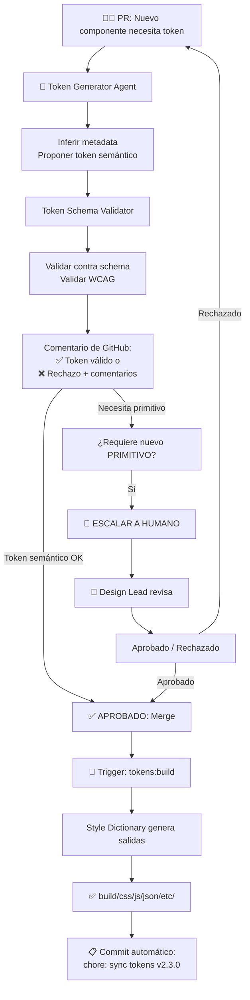

# FASE 3 — LÓGICA AGENTES + HUMANOS (GOVERNANCE LOOP)
> Agentes Ampliados + Responsabilidades + Procesos de Aprobación  
> Integración al Orquestador Existente

---

## 🤖 AGENTES NUEVOS (se suman a los 8 Contratos AGENT-CONTRACT.md)

### Agent 1: Token Schema Validator
**Responsabilidad:** Validar cada PR contra el schema de metadata

**Entrada:** PR con cambios a `01-tokens/` o `07-token-platform/tokens/`  
**Proceso:**
1. Parsear archivos JSON modificados
2. Validar cada token contra `token-metadata.schema.json`
3. Verificar que `$extensions.metadata` está poblada (no vacía)
4. Validar nombres derivan correctamente del schema
5. Validar que `element`, `attribute`, `purpose` son válidos (enum)

**Salida:** 
- ✅ APROBADO — Si cumple todo
- ❌ RECHAZADO con comentarios — Si viola schema
- 🟡 ATENCIÓN HUMANA — Si hay deprecation/removal

**Script:** `scripts/tokens-schema-validate.py`
```python
#!/usr/bin/env python3
"""Agent: Token Schema Validator"""

import json
import jsonschema
from pathlib import Path

class TokenSchemaValidator:
    def __init__(self, schema_path, tokens_path):
        with open(schema_path) as f:
            self.schema = json.load(f)
        with open(tokens_path) as f:
            self.tokens = json.load(f)
    
    def validate_pr(self, changed_files):
        """Validar tokens en PR"""
        errors = []
        for file in changed_files:
            if not file.endswith('.json'):
                continue
            try:
                with open(file) as f:
                    data = json.load(f)
                for token_name, token in self._flatten(data).items():
                    if '$extensions' not in token:
                        errors.append(f"❌ {token_name}: falta $extensions.metadata")
                        continue
                    metadata = token['$extensions'].get('metadata', {})
                    try:
                        jsonschema.validate(metadata, self.schema['properties']['metadata'])
                    except jsonschema.ValidationError as e:
                        errors.append(f"❌ {token_name}: {e.message}")
            except Exception as e:
                errors.append(f"❌ {file}: {e}")
        
        return {
            'status': 'PASSED' if not errors else 'FAILED',
            'errors': errors,
            'token_count': len(list(self._flatten(self.tokens)))
        }
    
    def _flatten(self, d, parent_key=''):
        """Flatten nested dict"""
        items = []
        for k, v in d.items():
            new_key = f"{parent_key}.{k}" if parent_key else k
            if isinstance(v, dict) and '$type' in v:
                items.append((new_key, v))
            elif isinstance(v, dict):
                items.extend(self._flatten(v, new_key))
        return dict(items)

if __name__ == "__main__":
    validator = TokenSchemaValidator(
        '07-token-platform/token-metadata.schema.json',
        '01-tokens/tokens.dtcg.json'
    )
    result = validator.validate_pr(['01-tokens/tokens.json'])
    print(json.dumps(result, indent=2))
```

---

### Agent 2: Token Generator
**Responsabilidad:** Proponer nuevos tokens cuando un componente lo requiere

**Entrada:** PR a `02-componentes/` que declara tokens faltantes  
**Proceso:**
1. Parsear component manifest del PR
2. Detectar `tokens_required` no declarados en `tokens.dtcg.json`
3. Inferir metadata del contexto (element, attribute, purpose, state)
4. **NO generar valores primitivos nuevos** (solo proponer semánticos)
5. Proponer PR con cambios sugeridos

**Salida:** 
- Pull Request automático con tokens propuestos
- Comentario: "Propongo 3 nuevos tokens para [Componente]. Requiere aprobación de Design Lead"

**Script:** `scripts/tokens-generate.py`
```python
#!/usr/bin/env python3
"""Agent: Token Generator — Propone nuevos tokens semánticos"""

class TokenGenerator:
    def __init__(self, manifest_path, tokens_path, schema_path):
        self.manifest = json.load(open(manifest_path))
        self.tokens = json.load(open(tokens_path))
        self.schema = json.load(open(schema_path))
    
    def infer_tokens(self, component_name):
        """Inferir tokens necesarios para un componente"""
        component = self.manifest['components'].get(component_name, {})
        required_tokens = component.get('tokens_required', [])
        existing_tokens = set(self._flatten_tokens().keys())
        
        missing = set(required_tokens) - existing_tokens
        proposals = []
        
        for token_path in missing:
            # Inferir metadata del nombre del token
            metadata = self._infer_metadata(token_path, component_name)
            
            proposal = {
                'path': token_path,
                'metadata': metadata,
                'requires_approval': 'primitive' in token_path or 'foundation' in token_path
            }
            proposals.append(proposal)
        
        return proposals
    
    def _infer_metadata(self, token_path, component_name):
        """Inferir metadata del token path y contexto"""
        return {
            'category': 'semantic',
            'element': [component_name],
            'attribute': self._parse_attribute(token_path),
            'purpose': self._parse_purpose(token_path),
            'prominence': 'medium',
            'state': ['default']
        }
    
    def _parse_attribute(self, token_path):
        if 'color' in token_path:
            return 'color'
        elif 'space' in token_path or 'padding' in token_path:
            return 'padding'
        elif 'radius' in token_path:
            return 'radius'
        elif 'motion' in token_path:
            return 'transition'
        return 'unknown'
    
    def _parse_purpose(self, token_path):
        if 'action' in token_path:
            return 'action'
        elif 'danger' in token_path:
            return 'danger'
        elif 'success' in token_path:
            return 'success'
        elif 'muted' in token_path:
            return 'muted'
        return 'neutral'
```

---

### Agent 3: Migration Assistant
**Responsabilidad:** Detectar hardcoded hex/px → proponer codemods a tokens

**Entrada:** PR a `02-componentes/` o `assets/` con valores crudos  
**Proceso:**
1. Escanear archivos CSS/HTML/JS en componentes
2. Detectar patterns: `#[0-9A-F]{6}`, `\d+px`, `\d+ms`
3. Razonar: "¿Existe un token para este valor?"
4. Proponer codemod + crear PR sugerido

**Ejemplo:**
```css
/* Detecta: */
.button { color: #5CD314; padding: 16px; }

/* Propone: */
.button { color: var(--mds-semantic-color-action); padding: var(--space-4); }
```

**Script:** `scripts/tokens-migrate.py`
```python
#!/usr/bin/env python3
"""Agent: Migration Assistant — Detecta hardcoded values"""

import re
from pathlib import Path

class MigrationAssistant:
    def __init__(self, tokens_path):
        self.tokens_dict = self._build_value_index(json.load(open(tokens_path)))
    
    def scan_file(self, file_path):
        """Escanear un archivo en busca de valores hardcodeados"""
        with open(file_path) as f:
            content = f.read()
        
        issues = []
        
        # Detectar hex colors
        for match in re.finditer(r'#([0-9A-Fa-f]{6})', content):
            hex_val = '#' + match.group(1)
            token = self._find_token_by_value(hex_val)
            if token:
                issues.append({
                    'line': content[:match.start()].count('\n') + 1,
                    'value': hex_val,
                    'suggestion': f'var(--{token})',
                    'type': 'color'
                })
        
        # Detectar spacing (px)
        for match in re.finditer(r'(\d+)px', content):
            px_val = int(match.group(1))
            token = self._find_token_by_pixel(px_val)
            if token:
                issues.append({
                    'line': content[:match.start()].count('\n') + 1,
                    'value': f'{px_val}px',
                    'suggestion': f'var(--{token})',
                    'type': 'spacing'
                })
        
        return issues
    
    def _build_value_index(self, tokens_dict):
        """Indexar tokens por valor para lookup rápido"""
        index = {}
        for token_name, token in self._flatten_tokens(tokens_dict).items():
            value = token.get('$value')
            index[value] = token_name
        return index
    
    def _find_token_by_value(self, value):
        """Buscar token por valor"""
        return self.tokens_dict.get(value)
```

---

### Agent 4: Token Diff Reporter
**Responsabilidad:** Generar reporte de cambios por release

**Entrada:** Commit messages o release tags  
**Proceso:**
1. Comparar `tokens.dtcg.json` entre versiones
2. Detectar: added, modified, deprecated, removed
3. Generar reporte: "En v2.3.0 se agregaron 5 tokens, se deprecaron 2"

**Salida:** `TOKENS-DIFF-v2.3.0.md` en release notes

**Script:** `scripts/tokens-diff.py`
```python
#!/usr/bin/env python3
"""Agent: Token Diff Reporter"""

class TokenDiffReporter:
    def __init__(self, old_tokens, new_tokens):
        self.old = self._index_tokens(old_tokens)
        self.new = self._index_tokens(new_tokens)
    
    def generate_diff(self):
        """Generar diff de cambios"""
        added = set(self.new.keys()) - set(self.old.keys())
        removed = set(self.old.keys()) - set(self.new.keys())
        modified = {
            k for k in self.old.keys() & self.new.keys()
            if self.old[k] != self.new[k]
        }
        deprecated = {
            k for k in self.new.keys()
            if self.new[k].get('$extensions', {}).get('metadata', {}).get('deprecated')
        }
        
        return {
            'added': sorted(added),
            'removed': sorted(removed),
            'modified': sorted(modified),
            'deprecated': sorted(deprecated),
            'summary': f"Cambios: +{len(added)} -{len(removed)} ~{len(modified)} ⚠️ {len(deprecated)}"
        }
    
    def format_markdown(self):
        """Generar reporte markdown para release notes"""
        diff = self.generate_diff()
        
        md = f"# Token Changes\n\n"
        md += f"## Summary\n{diff['summary']}\n\n"
        
        if diff['added']:
            md += f"## ✅ Added ({len(diff['added'])})\n"
            md += "```\n" + "\n".join(diff['added']) + "\n```\n\n"
        
        if diff['modified']:
            md += f"## 🔄 Modified ({len(diff['modified'])})\n"
            md += "```\n" + "\n".join(diff['modified']) + "\n```\n\n"
        
        if diff['deprecated']:
            md += f"## ⚠️ Deprecated ({len(diff['deprecated'])})\n"
            md += "Se removerán en la siguiente versión. Migretar a: ...\n"
            md += "```\n" + "\n".join(diff['deprecated']) + "\n```\n\n"
        
        if diff['removed']:
            md += f"## ❌ Removed ({len(diff['removed'])})\n"
            md += "```\n" + "\n".join(diff['removed']) + "\n```\n"
        
        return md
```

---

## 👥 RESPONSABILIDADES HUMANAS (Governance Gates)

### Design Lead
**Aprueba:** Nuevos primitivos, cambios de escala de colores  
**Rechaza:** Tokens sin justificación de negocio  

**Checklist de aprobación:**
- ¿Existe precedente en el sistema?
- ¿Tiene sentido para al menos 2 componentes?
- ¿Respeta principios de diseño?
- ¿Las variantes (brand×theme) están justificadas?

### Engineering Owner
**Aprueba:** Depreciaciones, cambios de nombres, migración  
**Rechaza:** Cambios que rompan consumidores sin alias  

**Checklist de aprobación:**
- ¿Todos los consumidores están mapeados?
- ¿Hay aliases de retrocompatibilidad?
- ¿Tests pasan al 100%?
- ¿Documentación está actualizada?

### Accessibility Reviewer
**Aprueba:** Tokens de color, contraste, focus estados  
**Rechaza:** Cualquier cambio que baje WCAG AA  

**Checklist de aprobación:**
- ¿Validado contra WCAG AA para todas las combinaciones brand×theme?
- ¿Estados focus/disabled tienen suficiente contraste?
- ¿No se comunica estado solo con color?

---

## 🔄 FLUJO INTEGRADO: Agent + Humano



---

## 🔗 INTEGRACIÓN AL ORQUESTADOR EXISTENTE (robust-maintain.py)

**Extender `robust-maintain.py` con nuevos steps:**

```python
class RobustMaintainer:
    def __init__(self):
        # ... existente ...
        self.token_validator = TokenSchemaValidator()
        self.token_generator = TokenGenerator()
        self.migration_assistant = MigrationAssistant()
        self.token_diff = TokenDiffReporter()
    
    def run_full_maintenance(self, recovery, test, tokens=True):
        """Agregar validación de tokens al pipeline"""
        
        steps = [
            ("Backup", self._step_backup),
            ("Validación de Tokens", self._step_validate_tokens),  # NUEVO
            ("Validación General", self._step_validate),
            ("Auditoría", self._step_audit),
            ("Sincronización Tokens", self._step_sync_tokens),  # NUEVO
            ("Generación", self._step_generate),
            ("Testing", self._step_test),
            ("Diff de Tokens", self._step_token_diff),  # NUEVO
            ("Reportes", self._step_reports),
            ("Snapshot", self._step_snapshot),
        ]
        
        # ... ejecutar steps ...
    
    def _step_validate_tokens(self):
        """Validar schema de tokens"""
        print("▶️  Validando schema de tokens...")
        result = self.token_validator.validate_pr([
            '01-tokens/tokens.json',
            '01-tokens/tokens.dtcg.json'
        ])
        if result['status'] == 'FAILED':
            print(f"❌ Token validation falló: {result['errors']}")
            return False
        print(f"✅ {result['token_count']} tokens validaron")
        return True
    
    def _step_sync_tokens(self):
        """Ejecutar tokens:build"""
        print("▶️  Sincronizando tokens con Style Dictionary...")
        subprocess.run(['npm', 'run', 'tokens:build'], check=True)
        print("✅ Build de tokens completado")
        return True
    
    def _step_token_diff(self):
        """Generar diff de cambios"""
        print("▶️  Generando reporte de cambios...")
        # ... comparar con versión anterior ...
        report = self.token_diff.format_markdown()
        with open('TOKENS-DIFF.md', 'w') as f:
            f.write(report)
        print("✅ Reporte de diff generado: TOKENS-DIFF.md")
        return True
```

---

## 📋 CI/CD JOB: Token Validation en Pull Request

**`.github/workflows/validate-tokens.yml` (nuevo):**

```yaml
name: Validate Tokens

on:
  pull_request:
    paths:
      - '01-tokens/**'
      - '07-token-platform/**'
      - 'package.json'

jobs:
  validate:
    runs-on: ubuntu-latest
    steps:
      - uses: actions/checkout@v3
      
      - name: Setup Node.js
        uses: actions/setup-node@v3
        with:
          node-version: '18'
      
      - name: Install dependencies
        run: npm install
      
      - name: Validate token schema
        run: npm run tokens:lint
      
      - name: Build tokens
        run: npm run tokens:build
      
      - name: Run tests
        run: npm test
      
      - name: Check WCAG compliance
        run: python3 scripts/validate-wcag.py
```

---

**FASE 3 Entregables:**
1. ✅ 4 Agentes nuevos definidos (Schema Validator, Generator, Migration, Diff Reporter)
2. ✅ Scripts Python para cada agente (4 scripts)
3. ✅ Governance gates claramente definidos (Design Lead, Eng Owner, A11y Reviewer)
4. ✅ Flujo integrado: Agent → Humano → Merge
5. ✅ Extensión a `robust-maintain.py`
6. ✅ CI/CD job `.github/workflows/validate-tokens.yml`
7. ✅ NUNCA merge automático (siempre requiere approval)
